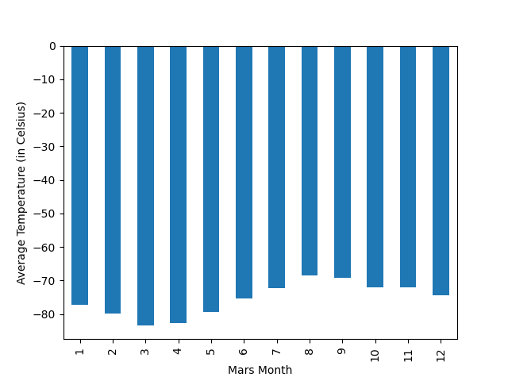

Part 1: Scrape Titles and Preview Text from Mars News
Use automated browsing to visit the Mars news siteLinks to an external site.. Inspect the page to identify which elements to scrape.

Create a Beautiful Soup object and use it to extract text elements from the website.

Extract the titles and preview text of the news articles that you scraped. Store the scraping results in Python data structures as follows:

(a) Store each title-and-preview pair in a Python dictionary and, give each dictionary two keys: title and preview.

(b) Store all the dictionaries in a Python list.

(c) Print the list in your notebook.

**Output of query**

Part 2: Scrape and Analyze Mars Weather Data
Use automated browsing to visit the Mars Temperature Data SiteLinks to an external site.. Inspect the page to identify which elements to scrape. Note that the URL is https://static.bc-edx.com/data/web/mars_facts/temperature.html.

Create a Beautiful Soup object and use it to scrape the data in the HTML table. Note that this can also be achieved by using the Pandas read_html function. However, use Beautiful Soup here to continue sharpening your web scraping skills.

Assemble the scraped data into a Pandas DataFrame. The columns should have the same headings as the table on the website. Here’s an explanation of the column headings:

id: the identification number of a single transmission from the Curiosity rover
terrestrial_date: the date on Earth
sol: the number of elapsed sols (Martian days) since Curiosity landed on Mars
ls: the solar longitude
month: the Martian month
min_temp: the minimum temperature, in Celsius, of a single Martian day (sol)
pressure: The atmospheric pressure at Curiosity's location
Examine the data types that are currently associated with each column. If necessary, cast (or convert) the data to the appropriate datetime, int, or float data types.

Analyze your dataset by using Pandas functions to answer the following questions:

How many months exist on Mars? Ans:12 Months

How many Martian (and not Earth) days worth of data exist in the scraped dataset? Ans:1866

What are the coldest and the warmest months on Mars (at the location of Curiosity)? To answer this question:

Find the average minimum daily temperature for all of the months.
Plot the results as a bar chart.

iv. Which months have the lowest and the highest atmospheric pressure on Mars? To answer this question:

a.Find the average daily atmospheric pressure of all the months.
b.Plot the results as a bar chart.
